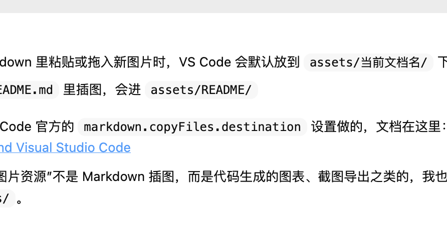
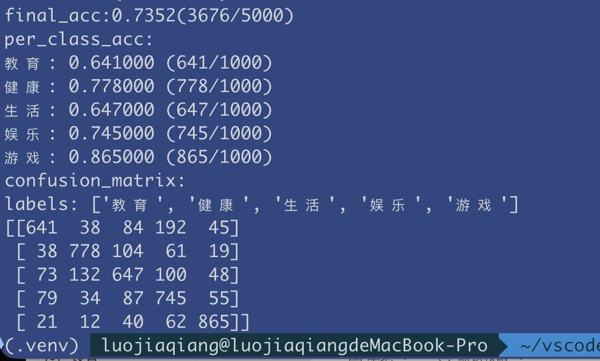

# 基于 TextCNN 的中文文本分类实验

## 项目改动核心

本次实验没有改动 TextCNN 的基本网络结构，重点是把原有教学代码补全为一个更完整的实验流程，使其能够完成“训练、验证、测试、结果分析”。

本项目与原始代码相比，核心改动主要有以下几点：

1. 在训练阶段增加了命令行参数支持，可以直接指定训练轮数，并控制是否从头开始训练。
2. 在训练过程中增加了验证集准确率评估，不再只观察训练损失，而是每个 epoch 结束后同步统计验证集效果。
3. 增加了最佳模型保存机制，在训练过程中自动保存验证集准确率最高的模型参数，便于后续测试。
4. 在测试阶段增加了更完整的结果输出，包括总体准确率、各类别准确率和混淆矩阵，便于后续性能分析。
5. 对运行环境进行了兼容处理，使代码在 GPU 不可用时也可以在 CPU 上运行。

这些改动都围绕实验主线展开，没有改动数据集抽样逻辑，也没有改动 TextCNN 的模型结构本身。

## 改动涉及的核心代码

### 1. 训练脚本增加参数控制

在 `train.py` 中增加参数解析，使训练脚本可以直接控制训练轮数、输出目录以及是否从头训练。

```python
def parse_args():
    parser = argparse.ArgumentParser(description='Train TextCNN for text classification.')
    parser.add_argument('--epochs', type=int, default=100, help='number of training epochs')
    parser.add_argument('--output-dir', default='outputs', help='directory for logs and saved weights')
    parser.add_argument('--from-scratch', action='store_true', help='ignore existing weight.pkl and initialize a new model')
    parser.add_argument('--save-checkpoints', action='store_true', help='save an extra checkpoint file after every epoch')
    return parser.parse_args()
```

这样做的意义是：实验过程中不需要频繁手动改代码，只通过命令行就可以控制训练配置。

### 2. 在训练阶段加入验证集评估

原始训练代码主要输出训练损失，本次实验补充了验证集评估函数，用于在每轮训练结束后计算验证集准确率。

```python
def evaluate(net, device, file_path='valdata_vec.txt'):
    labels, sentences = load_vectorized_data(file_path)
    total = len(labels)
    right = 0

    net.eval()
    with torch.no_grad():
        for label, sentence in zip(labels, sentences):
            sentence = torch.tensor(sentence, dtype=torch.long, device=device).unsqueeze(0)
            predict = net(sentence).argmax(dim=1).item()
            if predict == label:
                right += 1
    net.train()

    return right / total if total else 0.0
```

这样可以在训练过程中同步观察模型是否真正提升，而不是只看训练集上的损失变化。

### 3. 增加最佳模型保存逻辑

为了避免只保留最后一轮模型，本实验在训练脚本中加入了最佳模型保存机制。

```python
val_acc = evaluate(net, device)
log_test.write('{} {:.6f}\n'.format(epoch + 1, val_acc))

torch.save(net.state_dict(), weightFile)
if val_acc >= best_acc:
    best_acc = val_acc
    torch.save(net.state_dict(), bestWeightFile)
```

这样在测试阶段可以优先使用验证集效果最好的模型，而不是简单使用最后一轮训练结果。

### 4. 测试脚本增加完整评估结果输出

在 `test.py` 中，测试脚本会优先读取训练过程中保存的最佳模型，并输出总体准确率、各类别准确率和混淆矩阵。

```python
weight_candidates = [
    os.path.join(args.weight_dir, 'best_weight.pkl'),
    os.path.join(args.weight_dir, 'weight.pkl'),
    'best_weight.pkl',
    'weight.pkl',
    'textCNN.pkl',
]
```

```python
print('final_acc:{}({}/{})'.format(numRight / numAll, numRight, numAll))
print('per_class_acc:')
for idx in sorted(label_n2w):
    total = confusion[idx].sum()
    right = confusion[idx][idx]
    acc = right / total if total else 0.0
    print('{}: {:.6f} ({}/{})'.format(label_n2w[idx], acc, right, total))

print('confusion_matrix:')
print('labels:', [label_n2w[idx] for idx in sorted(label_n2w)])
print(confusion)
```

这部分结果能够支持后续对不同类别分类效果的分析，而不仅仅是得到一个总准确率数字。

## 如何使用

### 1. 重新训练模型

在项目目录下执行以下命令，可以从头开始重新训练模型：

```bash
python train.py --epochs 10 --from-scratch
```

说明如下：

- `--epochs 10` 表示训练 10 轮。
- `--from-scratch` 表示忽略原有权重文件，从头初始化模型参数重新训练。

训练过程中会输出每个 step 的损失，并在每个 epoch 结束后输出验证集准确率。模型和日志会保存在 `outputs/` 目录下。

### 2. 使用训练后的模型进行测试

训练完成后，可以执行以下命令进行测试：

```bash
python test.py
```

测试脚本会优先读取 `outputs/best_weight.pkl`，并输出以下信息：

- 总体准确率 `final_acc`
- 各类别准确率 `per_class_acc`
- 混淆矩阵 `confusion_matrix`

## 重新训练模型



## 结果测试


