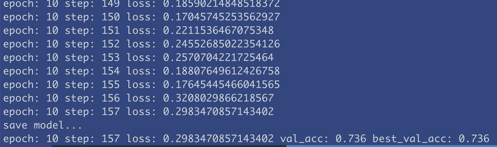
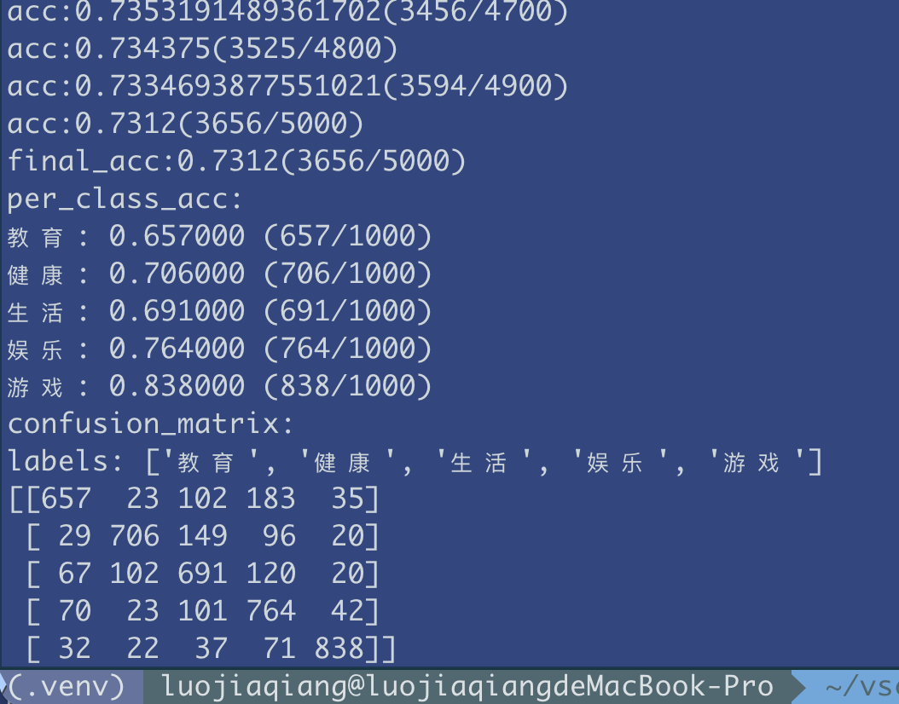
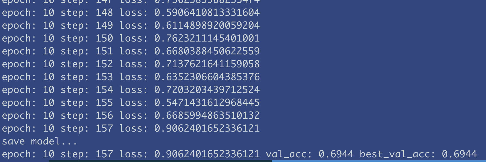
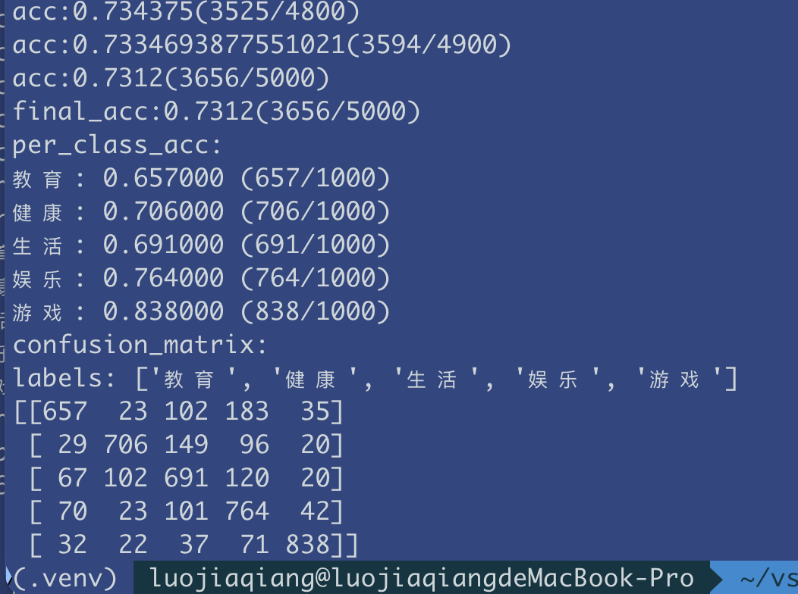
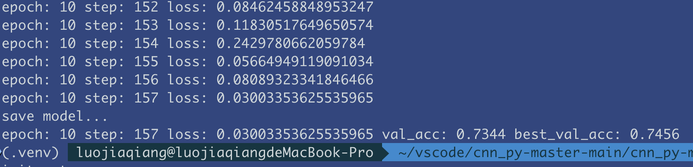
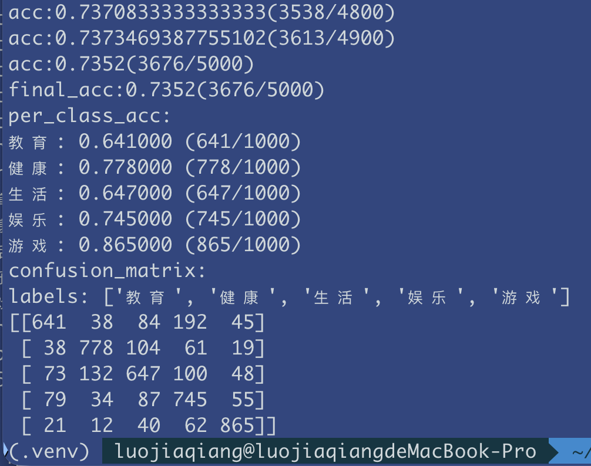
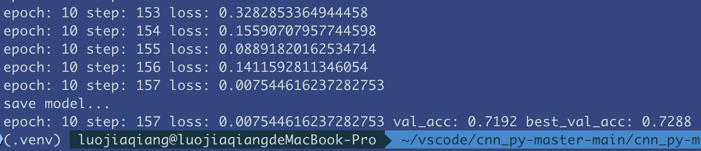
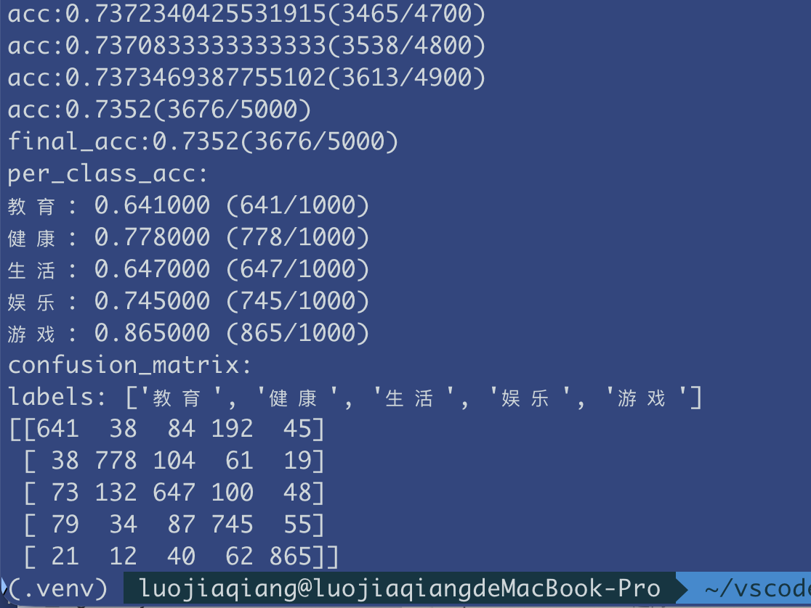
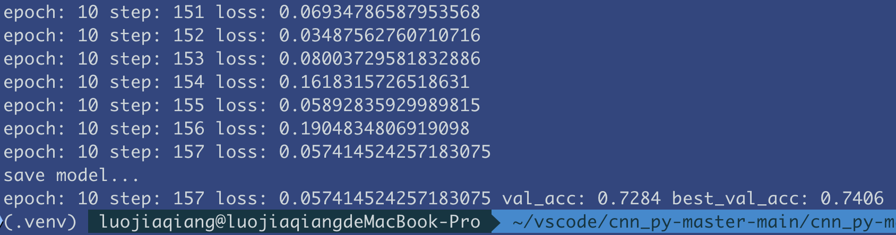
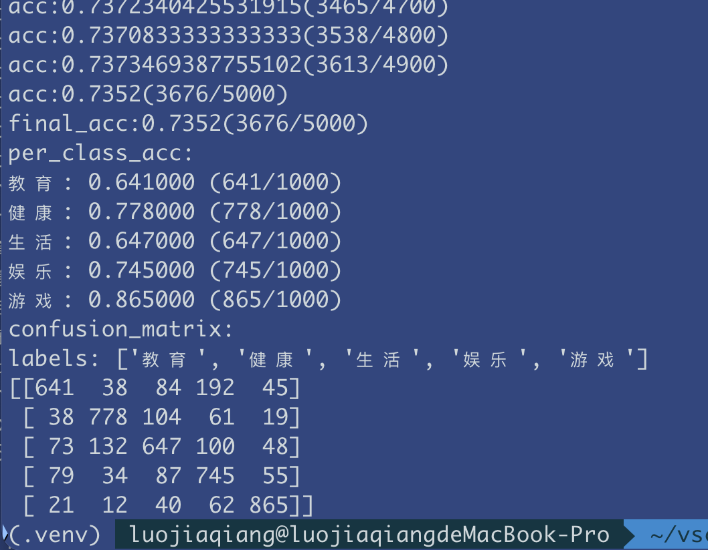

# 基于 TextCNN 的中文文本分类实验报告

## 1. 实验目的

本实验选择 TextCNN 作为文本分类模型，使用课程项目中提供的 `baike_qa2019` 数据子集完成中文短文本分类任务。实验目标是熟悉文本分类的基本流程，包括数据准备、文本预处理、模型训练、模型测试以及结果分析，并掌握 TextCNN 在文本分类任务中的基本应用方法。

本次实验只选择 `TextCNN` 方案，不使用 `BERT`。这符合课程作业中“TextCNN 与 BERT 二选一”的要求。

## 2. 数据集说明

本实验直接使用项目目录 `baike_qa2019` 下提供的两个数据文件：

- `my_traindata.json`
- `my_validdata.json`

每条数据均为一行 JSON，主要字段包括：

- `qid`：样本编号
- `category`：类别标签
- `title`：问题标题
- `desc`：问题描述
- `answer`：参考回答

本实验仅使用 `title` 字段作为文本分类输入，使用 `category` 字段前两个汉字作为一级类别标签。最终保留的 5 个类别为：

- 教育
- 健康
- 生活
- 娱乐
- 游戏

数据集规模如下：

| 数据集 | 样本数 | 类别数 | 说明 |
| --- | ---: | ---: | --- |
| 训练集 `my_traindata.json` | 20000 | 5 | 每类 4000 条 |
| 验证集 `my_validdata.json` | 5000 | 5 | 每类 1000 条 |

从类别分布可以看出，该数据子集是一个较为均衡的五分类数据集，适合用于教学实验和模型效果比较。

## 3. 文本预处理

本实验的数据预处理流程如下：

1. 读取训练集与验证集中的 `title` 字段。
2. 使用 `jieba` 对中文标题进行分词。
3. 使用 `stopword.txt` 去除停用词。
4. 使用 `wordLabel.txt` 构建词表并为每个词分配编号。
5. 将文本转换为固定长度的词索引序列。
6. 文本长度不足时进行补零，过长时进行截断。

项目中对应的主要脚本如下：

- `get_wordlists.py`：根据训练集统计词频并生成词表 `wordLabel.txt`
- `sen2inds.py`：将文本转换为数字化序列
- `textCNN_data.py`：读取数字化后的训练集与验证集

本实验预处理后的关键数据如下：

| 项目 | 数值 |
| --- | ---: |
| 词表大小 | 34889 |
| 训练样本数 | 20000 |
| 验证样本数 | 5000 |
| 文本最大长度 | 20 |

## 4. 模型构建

本实验采用经典 TextCNN 模型进行文本分类。模型整体结构如下：

1. 词嵌入层：将词编号映射为词向量。
2. 卷积层：使用 3 组不同大小的卷积核提取局部特征。
3. 最大池化层：对每组卷积结果做最大池化，保留最显著特征。
4. 特征拼接：将多组卷积特征拼接成一个向量。
5. Dropout 层：降低过拟合风险。
6. 全连接层：输出 5 个类别的分类结果。

对应代码位于 `model.py`，核心结构可以概括为：

```python
self.embed = nn.Embedding(vocab_size, embed_dim, padding_idx=1)
self.conv11 = nn.Conv2d(1, kernel_num, (3, embed_dim))
self.conv12 = nn.Conv2d(1, kernel_num, (4, embed_dim))
self.conv13 = nn.Conv2d(1, kernel_num, (5, embed_dim))
self.dropout = nn.Dropout(dropout)
self.fc1 = nn.Linear(len(kernel_size) * kernel_num, class_num)
```

本实验未使用预训练词向量，而是采用随机初始化的词向量进行训练。

## 5. 主要参数设置

本实验的基线参数设置如下：

| 参数 | 取值 |
| --- | --- |
| 模型 | TextCNN |
| 词向量维度 `embed_dim` | 60 |
| 卷积核个数 `kernel_num` | 16 |
| 卷积核大小 `kernel_size` | [3, 4, 5] |
| 类别数 `class_num` | 5 |
| Dropout | 0.5 |
| Batch Size | 128 |
| 优化器 | Adam |
| 学习率 | 0.01 |
| 损失函数 | NLLLoss |
| 输入文本长度 | 20 |

除基线设置外，为了分析不同超参数对模型效果的影响，本实验进一步设计了以下对比实验：

| 实验类型 | 对比取值 |
| --- | --- |
| 学习率实验 | 0.01 / 0.003 / 0.001 |
| 卷积核个数实验 | 16 / 32 / 64 |
| 输入长度实验 | 20 / 30 / 40 |
| Dropout 实验 | 0.3 / 0.5 / 0.6 |

## 6. 项目中的关键改动

本实验没有修改 TextCNN 的核心网络结构，主要是在原有教学代码基础上补充了训练和评估流程，使其更适合完成一次完整实验。关键改动如下：

1. 在 `train.py` 中增加了训练参数控制，支持直接指定训练轮数。
2. 在训练过程中增加了验证集准确率评估，而不仅仅输出训练损失。
3. 在训练时自动保存验证集准确率最高的模型参数。
4. 在 `test.py` 中增加了总体准确率、各类别准确率和混淆矩阵输出。
5. 对运行设备进行了兼容处理，使代码在 CPU 或 GPU 环境下都能正常运行。
6. 为支持学习率、卷积核个数、输入长度和 Dropout 对比实验，对训练、测试和向量化脚本做了参数化改造，使不同实验可以通过命令行切换完成。

改动后的核心代码包括：

### 6.1 训练参数控制

为了支持超参数对比实验，在 `train.py` 中增加了学习率、卷积核个数、Dropout、训练文件和验证文件等参数接口：

```python
def parse_args():
    parser = argparse.ArgumentParser(description='Train TextCNN for text classification.')
    parser.add_argument('--epochs', type=int, default=100, help='number of training epochs')
    parser.add_argument('--lr', type=float, default=0.01, help='learning rate')
    parser.add_argument('--kernel-num', type=int, default=16, help='number of kernels for each filter size')
    parser.add_argument('--dropout', type=float, default=0.5, help='dropout rate')
    parser.add_argument('--train-file', default='traindata_vec.txt', help='vectorized training file')
    parser.add_argument('--val-file', default='valdata_vec.txt', help='vectorized validation file')
    parser.add_argument('--output-dir', default='outputs', help='directory for logs and saved weights')
    parser.add_argument('--from-scratch', action='store_true', help='ignore existing weight.pkl and initialize a new model')
    parser.add_argument('--save-checkpoints', action='store_true', help='save an extra checkpoint file after every epoch')
    return parser.parse_args()
```

这样学习率实验、卷积核个数实验和 Dropout 实验都不需要手动修改源码，只需要在命令行中传入不同参数即可。

### 6.2 输入长度实验的兼容改造

输入长度实验不仅影响模型输入，还会影响向量化后的数据文件，因此本实验对 `sen2inds.py` 和 `test.py` 也进行了相应调整。

在 `sen2inds.py` 中增加了最大长度与输入输出文件参数：

```python
def parse_args():
    parser = argparse.ArgumentParser(description='Vectorize JSON text data for TextCNN.')
    parser.add_argument('--input-json', default=trainFile, help='input json lines file')
    parser.add_argument('--output-file', default=trainDataVecFile, help='output vector file')
    parser.add_argument('--max-len', type=int, default=maxLen, help='max token length')
    parser.add_argument('--no-shuffle', action='store_true', help='disable shuffling before vectorization')
    return parser.parse_args()
```

在 `test.py` 中，则将原来固定读取 20 个词索引的写法调整为读取标签之后的全部词索引：

```python
sentence = np.array([int(x) for x in data[1:]])
```

这样就可以分别生成长度为 20、30、40 的向量化文件，并复用同一套训练与测试脚本完成输入长度对比实验。

### 6.3 训练阶段增加验证集评估

```python
def evaluate(net, device, file_path='valdata_vec.txt'):
    labels, sentences = load_vectorized_data(file_path)
    total = len(labels)
    right = 0

    net.eval()
    with torch.no_grad():
        for label, sentence in zip(labels, sentences):
            sentence = torch.tensor(sentence, dtype=torch.long, device=device).unsqueeze(0)
            predict = net(sentence).argmax(dim=1).item()
            if predict == label:
                right += 1
    net.train()

    return right / total if total else 0.0
```

### 6.4 保存最优模型

```python
val_acc = evaluate(net, device)
log_test.write('{} {:.6f}\n'.format(epoch + 1, val_acc))

torch.save(net.state_dict(), weightFile)
if val_acc >= best_acc:
    best_acc = val_acc
    torch.save(net.state_dict(), bestWeightFile)
```

### 6.5 测试阶段输出完整评估结果

```python
print('final_acc:{}({}/{})'.format(numRight / numAll, numRight, numAll))
print('per_class_acc:')
for idx in sorted(label_n2w):
    total = confusion[idx].sum()
    right = confusion[idx][idx]
    acc = right / total if total else 0.0
    print('{}: {:.6f} ({}/{})'.format(label_n2w[idx], acc, right, total))

print('confusion_matrix:')
print('labels:', [label_n2w[idx] for idx in sorted(label_n2w)])
print(confusion)
```

## 7. 实验过程

本实验的主要流程如下：

1. 使用 `baike_qa2019` 中现成的训练集和验证集。
2. 使用词表文件与标签文件构造数字化输入。
3. 使用 TextCNN 对训练集进行训练。
4. 在每个 epoch 结束后计算验证集准确率。
5. 保存最佳模型，并使用测试脚本进行最终评估。

基线实验重新训练模型的命令如下：

```bash
python train.py --epochs 10 --from-scratch
```

训练完成后的测试命令如下：

```bash
python test.py
```

为了完成超参数对比实验，还可以采用如下方式组织实验。

### 7.1 学习率实验

在保持其他参数不变的条件下，分别设置学习率为 `0.01`、`0.003`、`0.001`，比较不同学习率对模型效果的影响。

```bash
python train.py --epochs 10 --from-scratch --lr 0.01 --output-dir outputs/lr_0.01
python train.py --epochs 10 --from-scratch --lr 0.003 --output-dir outputs/lr_0.003

python train.py --epochs 10 --from-scratch --lr 0.001 --output-dir outputs/lr_0.001

```
lr_0.003


lr_0.001


### 7.2 卷积核个数实验

在保持其他参数不变的条件下，分别设置卷积核个数为 `16`、`32`、`64`，比较不同特征提取能力下的分类效果。

```bash
python train.py --epochs 10 --from-scratch --kernel-num 16 --output-dir outputs/kernel_16
python train.py --epochs 10 --from-scratch --kernel-num 32 --output-dir outputs/kernel_32
python train.py --epochs 10 --from-scratch --kernel-num 64 --output-dir outputs/kernel_64
```
kernel_32


kernel_64


### 7.3 输入长度实验

输入长度实验需要先重新生成不同长度的向量化文件，再使用对应的训练集和验证集进行训练。

```bash
python sen2inds.py --input-json baike_qa2019/my_traindata.json --output-file traindata_vec_len30.txt --max-len 30
python sen2inds.py --input-json baike_qa2019/my_validdata.json --output-file valdata_vec_len30.txt --max-len 30 --no-shuffle
python train.py --epochs 10 --from-scratch --train-file traindata_vec_len30.txt --val-file valdata_vec_len30.txt --output-dir outputs/len_30
```

同理，可以生成长度为 `20` 和 `40` 的向量化文件，完成输入长度实验。

### 7.4 Dropout 实验

在保持其他参数不变的条件下，分别设置 Dropout 为 `0.3`、`0.5`、`0.6`，比较不同正则化强度对模型泛化性能的影响。

```bash
python train.py --epochs 10 --from-scratch --dropout 0.3 --output-dir outputs/dropout_0.3
python train.py --epochs 10 --from-scratch --dropout 0.5 --output-dir outputs/dropout_0.5
python train.py --epochs 10 --from-scratch --dropout 0.6 --output-dir outputs/dropout_0.6
```
dropout_0.3


每组实验训练完成后，都可以通过以下命令进行测试：

```bash
python test.py --weight-dir 对应实验输出目录
```

## 8. 训练过程截图

下图展示了重新训练模型时的终端输出，包括模型结构、训练损失以及验证集准确率。


## 9. 测试结果截图

下图展示了测试阶段的输出结果，包括总体准确率、各类别准确率以及混淆矩阵。


## 10. 实验结果

根据测试结果，模型在验证集上的总体准确率为：

```text
final_acc = 0.7194
```

即验证集总体分类准确率约为 **71.94%**。

各类别准确率如下：

| 类别 | 准确率 |
| --- | ---: |
| 教育 | 62.40% |
| 健康 | 74.80% |
| 生活 | 62.60% |
| 娱乐 | 75.60% |
| 游戏 | 84.30% |

混淆矩阵如下：

```text
labels: ['教育', '健康', '生活', '娱乐', '游戏']
[[624  44  76 218  38]
 [ 32 748 121  80  19]
 [ 70 120 626 148  36]
 [ 83  32  76 756  53]
 [ 32  11  26  88 843]]
```

## 11. 性能分析

从实验结果可以看出，TextCNN 在该五分类任务上能够取得较好的整体效果，但不同类别之间存在明显差异。

首先，`游戏` 类的分类效果最好，准确率达到 **84.30%**。这说明游戏类标题中的关键词较为集中、领域特征较强，例如游戏名称、玩法术语、装备角色等，模型更容易捕捉到稳定的局部特征。

其次，`健康` 和 `娱乐` 类的表现也相对较好，准确率分别为 **74.80%** 和 **75.60%**。这两类文本通常也包含较明显的主题词，因此模型能够较稳定地完成判断。

相对而言，`教育` 和 `生活` 两类的准确率较低，分别为 **62.40%** 和 **62.60%**。从混淆矩阵可以看出：

- `教育` 类有较多样本被误分到 `娱乐` 类。
- `生活` 类同时容易与 `健康`、`娱乐` 混淆。

造成这种现象的原因主要有以下几点：

1. 本实验仅使用 `title` 字段进行分类，文本长度较短，信息量有限。
2. 最大长度被固定为 20，部分标题中的有效信息可能被截断。
3. `教育`、`生活`、`健康`、`娱乐` 之间在语言表达上存在一定重叠，主题边界不如 `游戏` 类明显。
4. 本实验未使用预训练词向量，词语语义表示能力相对有限。

总体来看，TextCNN 作为一个结构简洁、训练速度较快的模型，适合完成入门级文本分类实验。但如果希望进一步提升分类准确率，尤其是改善类别之间的混淆问题，可以尝试以下方向：

- 引入预训练词向量；
- 结合 `desc` 字段而不仅仅使用 `title`；
- 适当调整文本最大长度；
- 使用更强的预训练语言模型。

## 12. 总结

本实验基于 `baike_qa2019` 数据子集，使用 TextCNN 完成了中文文本五分类任务，实现了从文本预处理、模型训练到结果测试的完整流程。实验结果表明，TextCNN 能够在该任务上取得约 **71.94%** 的验证集准确率，说明其在短文本分类任务中具有一定有效性。

通过本次实验，可以加深对文本分类基本流程、TextCNN 模型结构、训练参数设置以及分类结果分析方法的理解。同时也可以看到，传统卷积文本分类模型在短文本任务中仍然具有较好的实用性，但在语义表达与类别区分能力方面仍存在一定局限。
